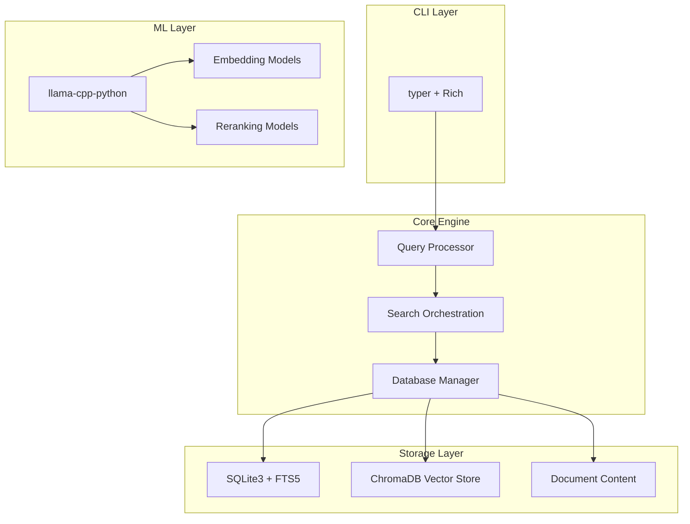
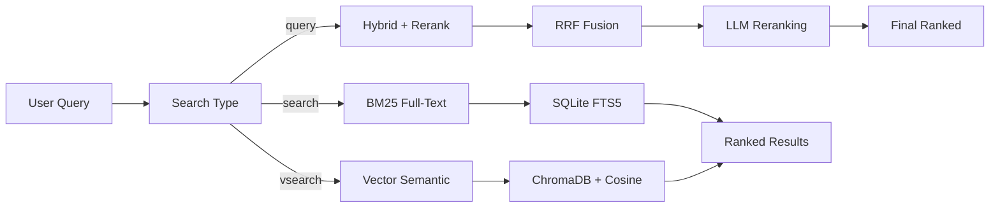

# QMD-Python: Architecture Design Document

## Overview

**Objective**: Rewrite QMD (Query Markup Documents) in Python to resolve Windows compatibility issues with `node-llama-cpp`.

**Target Users**: Developers who want fast, local search for markdown files with semantic understanding.

**Success Criteria**:
- ✅ All search modes work reliably on Windows/macOS/Linux
- ✅ Installation is `pip install` → works
- ✅ Vector search + reranking functional
- ✅ <30 minutes to first working prototype

---

## System Architecture

### High-Level Components



### Component Responsibilities

| Component | Responsibility | Tech Stack |
|------------|----------------|-----------|
| **CLI** | User interface, argument parsing | `click` + `typer` + `rich` |
| **Query Processor** | Parse user queries, expansion | LLM (qwen3) |
| **Search Orchestrator** | RRF fusion, reranking | Custom Python |
| **Database Manager** | CRUD operations, migrations | `sqlite3` |
| **Full-Text Search** | BM25 ranking | SQLite FTS5 extension |
| **Vector Store** | Semantic similarity | `chromadb` |
| **ML Engine** | Embeddings, reranking | `llama-cpp-python` |

---

## Data Model

### Collections (YAML Config)

**Location**: `~/.qmd/index.yml`

```yaml
collections:
  - name: todo
    path: ~/Documents/todo
    pattern: "**/*.md"
    contexts:
      - path: ""
        description: "Personal task lists and notes"
      - path: "work/"
        description: "Work-related tasks"

  - name: docs
    path: ~/projects/docs
    pattern: "**/*.md"
    contexts:
      - path: ""
        description: "Technical documentation"
```

**Rationale**:
- Matches existing QMD design (proven)
- YAML is human-editable
- Contexts improve search relevance

### Database Schema

**File**: `~/.qmd/index.sqlite`

```sql
-- Collections configuration
CREATE TABLE collections (
    name TEXT PRIMARY KEY,
    path TEXT NOT NULL,
    glob_pattern TEXT NOT NULL,
    created_at TEXT,
    last_modified TEXT
);

-- Document metadata
CREATE TABLE documents (
    id INTEGER PRIMARY KEY AUTOINCREMENT,
    collection TEXT NOT NULL,
    path TEXT NOT NULL,
    hash TEXT NOT NULL,
    title TEXT,
    active INTEGER DEFAULT 1,
    created_at TEXT,
    modified_at TEXT,
    UNIQUE(collection, path)
);

-- Document content (deduplicated by hash)
CREATE TABLE content (
    hash TEXT PRIMARY KEY,
    doc TEXT NOT NULL
);

-- Full-text search index (BM25)
CREATE VIRTUAL TABLE documents_fts USING fts5(
    title,
    content,
    content=documents,
    docid=documents,
    tokenize='unicode61'
);

-- Path contexts (hierarchical)
CREATE TABLE path_contexts (
    collection TEXT,
    path TEXT,
    context TEXT,
    PRIMARY KEY (collection, path)
);
```

**Vector Store** (ChromaDB):
```python
# ChromaDB collection (not SQLite)
collection.add(
    documents=[...],
    ids=["hash_seq", ...],  # e.g., "abc123_0", "abc123_1"
    metadatas=[{
        "hash": "abc123",
        "seq": 0,
        "collection": "todo"
    }, ...]
)
```

**Key Design Decisions**:
- **Hash deduplication**: Same content stored once (saves space)
- **Soft deletes**: `active` flag allows recovery
- **Separate vector store**: ChromaDB instead of sqlite-vec (maturity)
- **Hierarchical contexts**: Path-based inheritance (inherit parent context)

---

## Search Pipeline

### Three Search Modes



### 1. Full-Text Search (`qmd search`)

**Algorithm**: BM25 (Best Matching 25)

```python
def search_fts(
    db: sqlite3.Connection,
    query: str,
    collection: str = None,
    limit: int = 5
) -> list[SearchResult]:
    """
    Fast keyword-based search using SQLite FTS5.
    Returns documents ranked by BM25 score.
    """
    sql = """
        SELECT
            d.collection,
            d.path,
            d.title,
            snippet(content.doc, -2, '<b>', '</b>', 30) as snippet,
            bm25(documents_fts) as score
        FROM documents d
        JOIN content ON content.hash = d.hash
        JOIN documents_fts ON documents_fts.rowid = d.rowid
        WHERE d.active = 1
          AND (? IS NULL OR d.collection = ?)
          AND documents_fts MATCH ?
        ORDER BY score DESC
        LIMIT ?
    """
    params = [collection, collection, query, limit]
    results = db.execute(sql, params).fetchall()

    return [
        SearchResult(
            file=f"{r['collection']}/{r['path']}",
            title=r['title'],
            score=normalize_bm25(r['score']),
            snippet=r['snippet']
        )
        for r in results
    ]
```

**Pros**:
- ✅ Instant results (<50ms)
- ✅ No ML overhead
- ✅ Exact keyword matching

**Cons**:
- ❌ No semantic understanding
- ❌ Sensitive to spelling errors

### 2. Vector Search (`qmd vsearch`)

**Algorithm**: Cosine similarity

```python
def search_vector(
    db: sqlite3.Connection,
    collection: chromadb.Collection,
    query: str,
    limit: int = 5
) -> list[SearchResult]:
    """
    Semantic search using vector embeddings.
    Returns documents ranked by cosine similarity.
    """
    # 1. Generate query embedding
    query_embedding = llm.embed(query, model="embedding")

    # 2. Search ChromaDB
    results = collection.query(
        query_embeddings=[query_embedding],
        n_results=limit * 2,  # Fetch more for filtering
        where={"collection": collection} if collection else None
    )

    # 3. Convert to results
    return [
        SearchResult(
            file=f"{r['collection']}/{r['path']}",
            title=r['title'],
            score=r['distance'],  # Already 0-1 range
            snippet=extract_snippet(r['path'], query)
        )
        for r in results['documents'][0:limit]
    ]
```

**Pros**:
- ✅ Semantic understanding
- ✅ Handles typos (phonetic similarity)
- ✅ Cross-lingual matching

**Cons**:
- ❌ Slower (~500-2000ms for embeddings)
- ❌ Requires LLM runtime
- ❌ May miss exact keyword matches

### 3. Hybrid Search (`qmd query`)

**Algorithm**: Reciprocal Rank Fusion (RRF) + LLM Reranking

```python
def search_hybrid(
    db: sqlite3.Connection,
    collection: chromadb.Collection,
    llm: LlamaEngine,
    query: str,
    limit: int = 5
) -> list[SearchResult]:
    """
    Best-quality search combining full-text + vector + reranking.
    """
    # 1. Query expansion (generate variants)
    expansion_variants = llm.generate_variants(query)
    queries = [query] + expansion_variants

    # 2. Parallel search (FTS + Vector for each query)
    all_results = []
    for q in queries:
        fts = search_fts(db, q, collection, limit=20)
        vec = search_vector(db, collection, q, limit=20)
        all_results.extend(fts + vec)

    # 3. RRF fusion (k=60)
    rrf_scores = rrf_fusion(all_results, k=60)

    # 4. Top-30 reranking
    top_candidates = sorted(rrf_scores.items(), key=lambda x: x[1], reverse=True)[:30]

    # 5. LLM reranking
    reranked = llm.rerank(query, top_candidates)

    # 6. Position-aware blending
    final_results = blend_results(reranked, rrf_scores)

    return final_results[:limit]
```

**RRF Formula**:
```python
def rrf_fusion(results: list[SearchResult], k: int = 60) -> dict[str, float]:
    """
    Combine rankings from multiple lists.
    Formula: score = Σ 1/(k + rank)
    """
    scores = {}
    for result in results:
        score = scores.get(result.file, 0.0)
        score += 1.0 / (k + result.rank)
        scores[result.file] = score
    return scores
```

**Reranking Strategy**:
```python
# LLM returns scores 0-1 (confidence)
# Blend: 75% RRF for top-3, 25% for 10+
def blend_results(
    reranked: dict[str, float],
    rrf_scores: dict[str, float]
) -> list[SearchResult]:
    for i, (file, llm_score) in enumerate(reranked.items()):
        rrf_score = rrf_scores[file]

        if i < 3:  # Top-3: Trust RRF more
            final_score = 0.75 * rrf_score + 0.25 * llm_score
        elif i < 10:  # Top-10: Balanced
            final_score = 0.60 * rrf_score + 0.40 * llm_score
        else:  # 10+: Trust LLM more
            final_score = 0.40 * rrf_score + 0.60 * llm_score

        result.file = file
        result.score = final_score

    return results
```

---

## LLM Integration

### Models

| Model | Purpose | Quantization | Size |
|--------|---------|--------------|------|
| `qwen3-query-expansion` | Generate query variants | Q4_K_M | 1.1GB |
| `embeddingemma-2b` | Vector embeddings | Q8_0 | 300MB |
| `qwen3-reranker` | Document reranking | Q8_0 | 640MB |

**Total Download Size**: ~2GB (one-time, cached in `~/.qmd/models/`)

### Inference Engine

```python
from llama_cpp import Llama

class LlamaEngine:
    def __init__(self, model_path: str):
        self.llama = Llama(
            model_path=model_path,
            n_threads=4,  # Autodetect CPU cores
            n_ctx=2048,   # Context window
            verbose=False
        )

    def embed(self, text: str) -> list[float]:
        """Generate 384-dim embedding vector."""
        return self.llama.embed(text)

    def generate_variants(self, query: str) -> list[str]:
        """Generate 2-3 query variants."""
        prompt = f"Generate 2 alternative search queries for: {query}\nQueries:"
        response = self.llama(prompt, max_tokens=50)
        return parse_queries(response)

    def rerank(self, query: str, docs: list[str]) -> dict[str, float]:
        """
        Cross-encoder reranking.
        Returns {doc: score} where score ∈ [0, 1].
        """
        return self.llama.rerank(query, docs)
```

**Optimizations**:
- Model caching (load once, reuse)
- Async embedding generation (parallel batch)
- Token counting (avoid unnecessary inference)

---

## Error Handling

### Strategy

```python
class QMDError(Exception):
    """Base exception for QMD-specific errors."""
    pass

class CollectionNotFoundError(QMDError):
    """Raised when collection doesn't exist."""
    pass

class DocumentNotFoundError(QMDError):
    """Raised when document not found."""
    pass

class ModelDownloadError(QMDError):
    """Raised when model download fails."""
    pass

# Usage
try:
    results = qmd.search(query)
except ModelDownloadError as e:
    console.print(f"[red]Failed to download model: {e}")
    console.print("Run 'qmd download --models' to retry")
    sys.exit(1)
except Exception as e:
    console.print(f"[red]Unexpected error: {e}")
    if DEBUG:
        console.print_exception()
    sys.exit(1)
```

### User-Facing Errors

| Scenario | Error Message | Action |
|-----------|---------------|--------|
| Collection not found | `"Collection 'xyz' not found. Run 'qmd collection list'." | Suggest next command |
| No documents indexed | `"No documents in collection. Run 'qmd index'." | Prompt indexing |
| Model missing | `"Model not found. Downloading... (2GB)"` | Auto-download with progress |
| Database locked | `"Database in use. Close other QMD instances."` | Clear instruction |

---

## Performance Considerations

### Expected Latency

| Operation | Expected Time | Bottleneck |
|-----------|---------------|-----------|
| BM25 search | 10-50ms | SQLite query |
| Vector search | 500-2000ms | Embedding (CPU-bound) |
| Hybrid search | 2000-5000ms | Reranking (LLM) |
| Document retrieval | <10ms | Disk I/O |

### Optimizations

1. **Embedding Caching**
   ```python
   @functools.lru_cache(maxsize=1000)
   def get_embedding(text: str) -> list[float]:
       return llm.embed(text)
   ```

2. **Batch Embedding**
   ```python
   embeddings = llm.embed_batch(texts)  # Parallel
   ```

3. **Database Indexing**
   ```sql
   CREATE INDEX idx_documents_collection ON documents(collection, active);
   CREATE INDEX idx_documents_hash ON documents(hash);
   ```

4. **Async I/O**
   ```python
   import asyncio
   async def index_files(files: list[str]):
       tasks = [index_file(f) for f in files]
       await asyncio.gather(*tasks)
   ```

---

## Directory Structure

```
qmd-python/
├── qmd/
│   ├── __init__.py
│   ├── cli.py              # Click commands
│   ├── database/
│   │   ├── __init__.py
│   │   ├── schema.py          # SQLite schema
│   │   └── manager.py         # CRUD operations
│   ├── search/
│   │   ├── __init__.py
│   │   ├── fts.py              # BM25 search
│   │   ├── vector.py            # ChromaDB search
│   │   └── hybrid.py           # RRF fusion
│   ├── llm/
│   │   ├── __init__.py
│   │   ├── engine.py            # llama-cpp wrapper
│   │   └── cache.py             # Embedding cache
│   ├── index/
│   │   ├── __init__.py
│   │   └── crawler.py           # File scanner
│   └── models/
│       ├── __init__.py
│       ├── config.py            # YAML collections
│       └── document.py           # Data classes
├── tests/
│   ├── unit/
│   │   ├── test_search.py
│   │   ├── test_database.py
│   │   └── test_llm.py
│   ├── integration/
│   │   └── test_workflow.py
│   └── benchmarks/
│       └── bench_search.py
├── docs/
│   ├── ROOT-CAUSE.md           # This document
│   ├── REQUIREMENTS.md
│   └── TESTING.md
├── pyproject.toml
└── README.md
```

**File Count Estimate**: ~30 files (vs QMD's ~15 TypeScript files)

---

## Migration from QMD (TypeScript)

### Data Compatibility

**Keep Same**: 
- Database schema (direct SQL queries can be reused)
- YAML collection config (re-parse with PyYAML)
- GGUF models (same files)

**Translate**:
- TypeScript → Python type hints
- Bun APIs → Python builtins
- fast-glob → glob / pathlib

### Command Parity

| QMD Command | Python Equivalent |
|-------------|------------------|
| `qmd status` | `qmd status` |
| `qmd collection add . --name xyz` | `qmd collection add . --name xyz` |
| `qmd index` | `qmd index` |
| `qmd embed` | `qmd embed` |
| `qmd search "query"` | `qmd search "query"` |
| `qmd vsearch "query"` | `qmd vsearch "query"` |
| `qmd query "query"` | `qmd query "query"` |
| `qmd get #abc123` | `qmd get abc123` |

**User Impact**: Zero (same CLI interface)

---

## Security & Privacy

### Local-First Design

- ✅ All data stored locally (SQLite + ChromaDB)
- ✅ Models run locally (llama-cpp)
- ✅ No network calls after model download
- ✅ No telemetry (optional opt-in)

### Model Security

- GGUF format: Pre-quantized, no code execution
- Sandboxing: llama-cpp runs in-process (no shell access)
- Input validation: Sanitize user queries before LLM

### File Access

- Follows OS permissions (respects ~/.qmd)
- No privilege escalation
- Warns before indexing sensitive paths

---

## Deployment

### Installation

```bash
# User installation
pip install qmd-python

# Development
git clone https://github.com/yourname/qmd-python
cd qmd-python
poetry install
```

### Dependencies (Production)

```toml
[tool.poetry.dependencies]
python = "^3.10"
click = "^8.1"              # CLI
rich = "^13.0"              # Formatting
pyyaml = "^6.0"             # YAML config
chromadb = "^0.4"           # Vector DB
llama-cpp-python = "^0.2"    # LLM inference
```

### Dependencies (Development)

```toml
[tool.poetry.dev-dependencies]
pytest = "^7.0"             # Testing
pytest-cov = "^4.0"         # Coverage
pytest-benchmark = "^4.0"    # Benchmarks
ruff = "^0.1"               # Linting
mypy = "^1.0"               # Type checking
```

---

## Success Criteria

### Milestone 1: MVP (Week 1)
- [x] Database schema + migrations
- [ ] CLI skeleton (all commands defined)
- [ ] BM25 search working
- [ ] Document indexing working

### Milestone 2: Vector Search (Week 2)
- [ ] ChromaDB integration
- [ ] llama-cpp embedding
- [ ] Vector search command

### Milestone 3: Hybrid + Polish (Week 3)
- [ ] RRF fusion
- [ ] LLM reranking
- [ ] Query expansion
- [ ] Error handling

### Milestone 4: Production Ready (Week 4)
- [ ] Performance optimization
- [ ] Documentation
- [ ] Test coverage >80%
- [ ] PyPI publish

---

## References

- **QMD Original**: https://github.com/tobi/qmd
- **llama-cpp-python**: https://github.com/abetlen/llama-cpp-python
- **ChromaDB**: https://docs.trychroma.com/
- **BM25**: https://en.wikipedia.org/wiki/Okapi_BM25
- **RRF**: https://en.wikipedia.org/wiki/Reciprocal_rank_fusion
